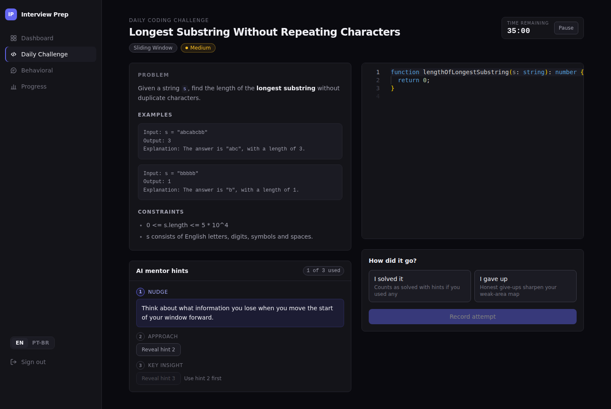
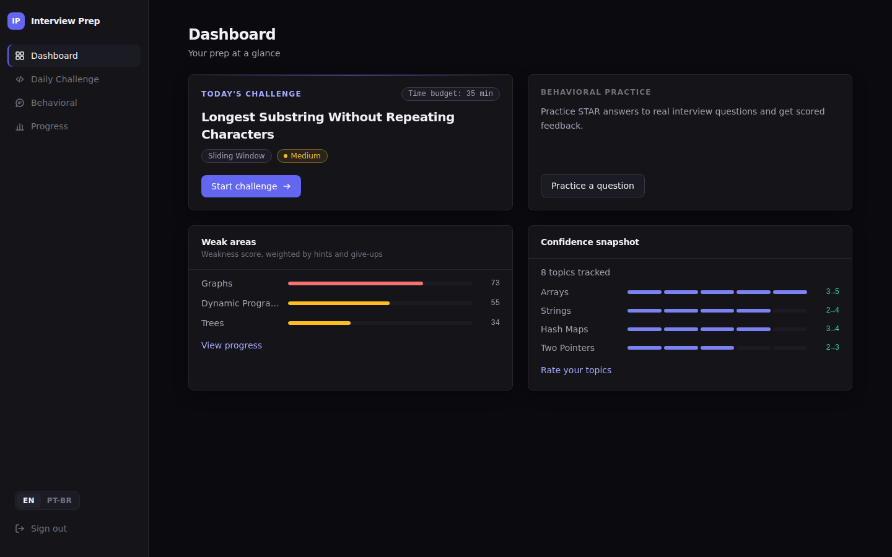
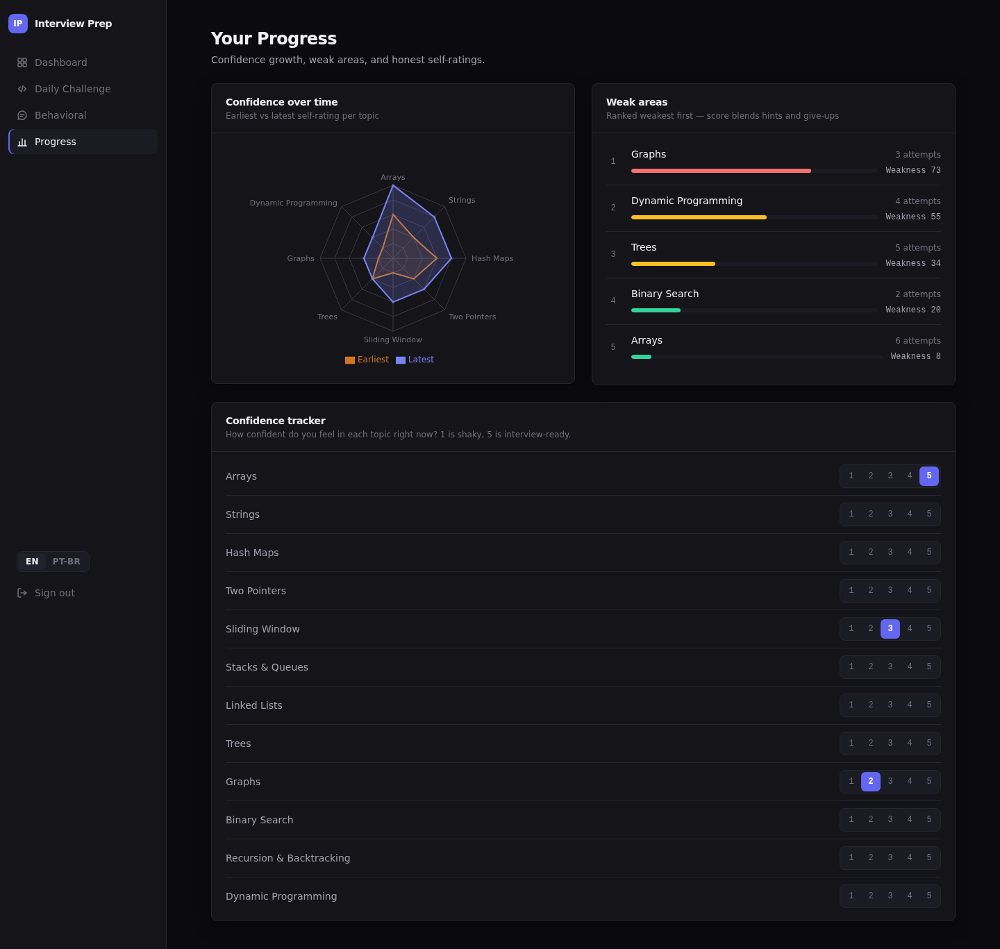
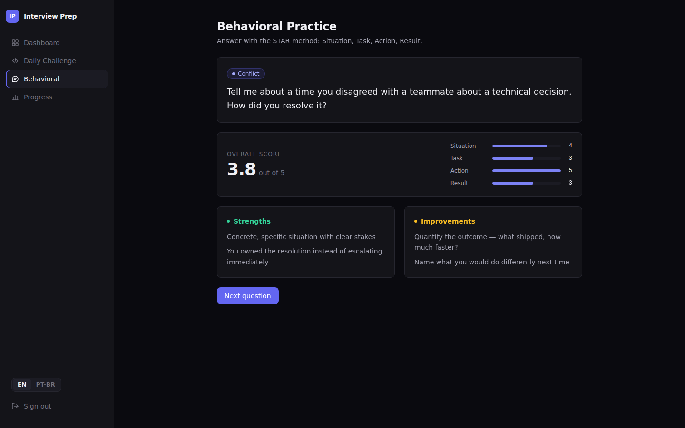
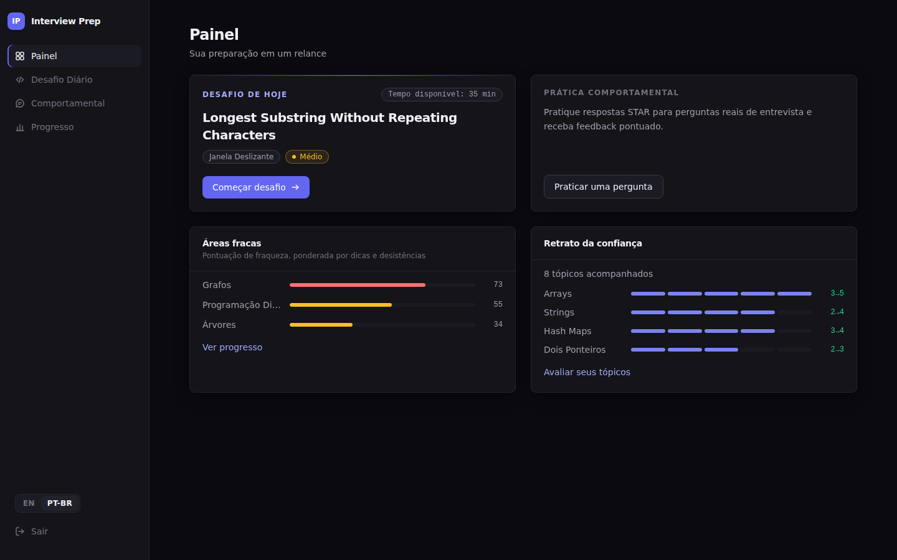

# Interview Prep Platform

Interview prep is scattered — coding problems on one site, system design on another, behavioral questions nowhere. This platform brings it together: one curated coding challenge per day under a real interview timer, an AI mentor that nudges without spoiling, behavioral practice with structured STAR feedback, and honest tracking of where you are weakest.



## Features

- **Daily coding challenge** — a curated bank of 24 real interview problems across 12 topics and 3 difficulties; the same challenge for everyone on a given day, picked deterministically.
- **AI mentor hints** — three escalating levels (nudge → approach → key insight) that see your current code but are instructed to never reveal the solution. Powered by any model on OpenRouter.
- **Interview pressure timer** — 20/35/50 minutes by difficulty, with calm → warning → critical states as time runs out.
- **Weak-area tracking** — every attempt records outcome, hints used, and time; topics are ranked by a weakness score that penalizes hints and give-ups.
- **Behavioral practice** — answer curated questions and get STAR-method feedback: per-criterion scores, strengths, and concrete improvements.
- **Confidence tracker** — rate yourself 1–5 per topic and watch a radar chart compare your earliest self-assessment against today's.

| Dashboard | Progress radar |
| --- | --- |
|  |  |

| STAR feedback | Localized (pt-BR) |
| --- | --- |
|  |  |

## Stack

Next.js 16 (App Router) · TypeScript strict · Tailwind CSS 4 · Supabase (Postgres + Auth with RLS) · OpenRouter · Monaco Editor · Recharts · Zustand · next-intl (English default, Brazilian Portuguese) · Vitest + Testing Library

## Architecture

Clean architecture with an enforced dependency rule:

```
src/core/domain          entities, invariants, pure logic (zero dependencies)
src/core/application     use cases and ports (interfaces the outside must satisfy)
src/core/contracts       request/response DTOs shared by API routes and UI
src/infrastructure       Supabase and OpenRouter adapters implementing the ports
src/app/api              thin route handlers: session, validation, delegation
src/app/[locale]         localized pages, components, hooks, stores
```

Domain and use cases never import frameworks, vendors, or IO — they are exercised by fast unit tests against in-memory fakes. Identity is never trusted from the client: user id, topic, and difficulty are derived server-side, and Postgres row-level security enforces per-user isolation independently of application code. The full design — API table, database schema, i18n and state strategy — lives in [docs/ARCHITECTURE.md](docs/ARCHITECTURE.md).

## Getting started

### 1. Supabase

Create a project at [supabase.com](https://supabase.com), then run the SQL files in the dashboard SQL editor (or `supabase db push` with the CLI): every file in `supabase/migrations/` in filename order, followed by `supabase/seed.sql`. The seed is idempotent — running it again never duplicates content.

Email/password auth is used as provided by Supabase defaults.

### 2. Environment

```bash
cp .env.example .env.local
```

| Variable | Purpose |
| --- | --- |
| `NEXT_PUBLIC_SUPABASE_URL` | your Supabase project URL |
| `NEXT_PUBLIC_SUPABASE_ANON_KEY` | your Supabase anon key |
| `OPENROUTER_API_KEY` | API key from [openrouter.ai](https://openrouter.ai) |
| `OPENROUTER_MODEL` | optional, defaults to `openai/gpt-4o` |

### 3. Run

```bash
npm install
npm run dev
```

## Scripts

| Script | Purpose |
| --- | --- |
| `npm run dev` | start the dev server |
| `npm run build` | production build |
| `npm run start` | serve the production build |
| `npm run lint` | ESLint |
| `npm run typecheck` | TypeScript, no emit |
| `npm run test` | Vitest, single run |
| `npm run test:watch` | Vitest in watch mode |

## Testing

243 tests across 52 files, written test-first: domain invariants, use cases against in-memory fakes, repositories against captured query shapes, the AI gateway against a faked transport (prompt escalation, spoiler guard, malformed-output rejection), route handlers for every status path including authorization, and component behavior with Testing Library — plus locale key-parity tests keeping both languages complete.

## Notes

- The Monaco editor is loaded by `@monaco-editor/react` from jsDelivr at runtime, so the challenge editor needs network access in the browser.
- The production build succeeds with no environment variables set; configuration is read per request, never at import time.
